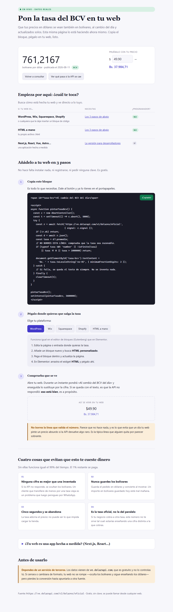

# Tasa BCV

Muestra precios en bolívares al cambio oficial del día, en cualquier web.
Módulo sin dependencias + guía paso a paso para quien no programa.

**[→ Ver la demo en vivo](https://TU-USUARIO.github.io/tasa-bcv/)** ·
21 tests · sin dependencias de runtime · MIT

<!-- Sustituye TU-USUARIO por tu usuario de GitHub cuando actives Pages. -->



## El problema

Un negocio venezolano cobra en dólares pero el cliente transfiere en bolívares.
La tasa cambia todos los días hábiles. Ponerla a mano significa que alguien se
acuerde cada mañana; ponerla mal significa que un cliente transfiera de menos y
haya que perseguirlo por WhatsApp.

## La decisión que define el módulo

**Si no hay tasa fiable, no se muestra ninguna cifra.**

Es tentador guardar la última tasa conocida y enseñarla cuando la API falla.
Es exactamente lo que no hay que hacer: una tasa de hace tres días parece
correcta, nadie la cuestiona, y la diferencia la pagas tú. El módulo devuelve
`source: 'fallback'` y la interfaz enseña *«Al cambio del BCV del día»*.

```ts
const tasa = await obtenerTasaBcv();

tasa.source === 'bcv'
  ? `Bs. ${formatear(precioUsd * tasa.rate)}`
  : 'Al cambio del BCV del día';   // nunca una cifra vieja
```

Hay un test que falla si alguien rompe esa regla, y el CI maneja la demo en un
navegador real para comprobar que con la API caída no aparece ningún `Bs.` en
pantalla.

## Otras tres decisiones que no son obvias

**Un techo de cordura en la validación.** Se rechaza cualquier tasa fuera de
`(0, 1.000.000]`. Si DolarAPI cambiara de escala, $100 pasarían a ser millones
de bolívares sin que nada avisara. Es una línea que parece sobrante y es la que
evita el desastre.

**El fallback no se cachea.** El dato bueno se guarda una hora; un fallo, no.
Cachear el fallo dejaría la web una hora entera sin bolívares por un tropiezo
puntual de la API.

**Contexto, no store global.** Repartir la tasa con un store sembrado durante
el render hace que el HTML del servidor salga *sin* bolívares y el precio
aparezca al cargar el JavaScript. No se ve en el navegador: se ve haciendo
`curl tu-web | grep Bs.`

## Qué te llevas

La pregunta no es si programas, es si tu web tiene build o servidor.

| Tu web | Qué usas |
| --- | --- |
| WordPress, Wix, Squarespace, Shopify | [`embed/tasa-bcv.html`](embed/tasa-bcv.html) — copiar y pegar |
| Sitio estático (HTML, Hugo, Jekyll) | [`embed/tasa-bcv.html`](embed/tasa-bcv.html) — aunque programes |
| Next.js, React, Vue, Astro | [`src/`](src/) — el módulo |
| Node/Express sirviendo HTML | [`src/tasaBcv.ts`](src/tasaBcv.ts) + [`src/tasaServidor.ts`](src/tasaServidor.ts) |

| Archivo | Qué hace |
| --- | --- |
| [`src/tasaBcv.ts`](src/tasaBcv.ts) | El núcleo. Autónomo, no importa nada. Fetch + validación + timeout de 5 s |
| [`src/tasaServidor.ts`](src/tasaServidor.ts) | Caché de 1 h. Convierte 100 visitas en 1 petición |
| [`src/TasaContext.tsx`](src/TasaContext.tsx) | Reparto por contexto + `formatearBs()` |
| [`src/PrecioBs.tsx`](src/PrecioBs.tsx) | Componente que se calla si la tasa no es real |
| [`src/RefrescoTasa.tsx`](src/RefrescoTasa.tsx) | Refresco al volver a primer plano (PWA) |
| [`sql/bcv_rates.sql`](sql/bcv_rates.sql) | Histórico opcional |

## Uso en Next.js

Resuélvela en el layout raíz, antes de generar el HTML, para que todos los
precios de la página nazcan con la misma tasa:

```tsx
// app/layout.tsx
export default async function RootLayout({ children }) {
  const tasa = await getTasaBcv();
  return <TasaContext.Provider value={tasa}>{children}</TasaContext.Provider>;
}
```

```tsx
<PrecioBs precioUsd={49.9} />
```

Si tu proyecto es JavaScript sin TypeScript, usa el compilado
(`npm run demo:build` → `demo/dist/tasaBcv.js`), que es el mismo código.

## Verificar

```bash
npm install
npm test          # 21 tests, sin red
npm run typecheck
npm run demo      # la guía en http://localhost:4173
node scripts/verificar-demo.mjs   # la maneja en un navegador real
```

Los tests cubren el camino feliz, los cinco modos de fallo, cada rama de la
validación, el timeout de 5 s y el caché — incluido que un `fallback` **no** se
cachea.

## Letra pequeña

Los datos vienen de [DolarAPI](https://ve.dolarapi.com), gratuito y sin clave.
Es un servicio de terceros: si cerrara, la web no se rompe (oculta los
bolívares y sigue enseñando dólares), pero pierdes la conversión hasta apuntar
a otra fuente. Razón de más para guardar el histórico.

Es la **tasa oficial del BCV**, no la del paralelo. Si tu negocio cobra a otra
tasa, este número no te sirve tal cual.

## Licencia

MIT
